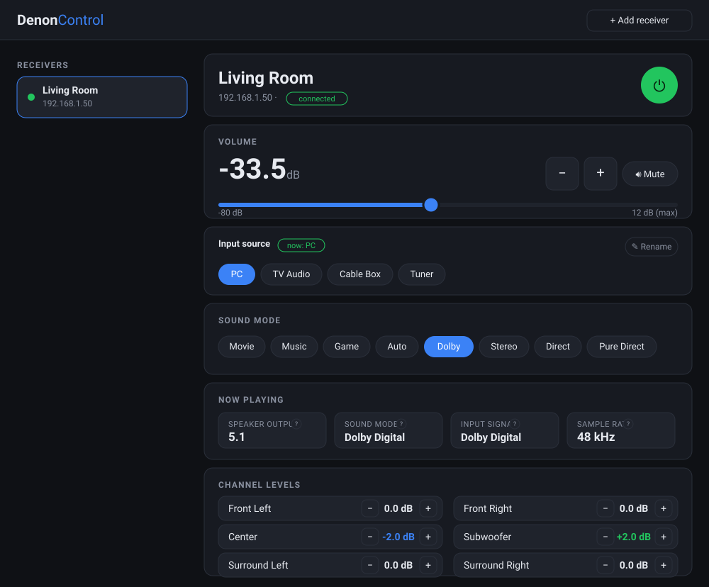

# Denon Web UI

A simple, self-hosted web interface to control Denon (and most Marantz) AVR
receivers over their built-in telnet control protocol (TCP port 23). Add a
receiver by IP, then control everything — power, volume, mute, input source,
sound mode, and per-channel levels — from any browser on your network. State
updates live, even when you use the physical remote.

**Zero npm dependencies** — just Node.js.

> Built by [Claude](https://claude.com/claude-code) (Anthropic's Claude Code),
> pair-programmed with [@VakSon](https://github.com/VakSon).



## Features

- **Add receivers by IP** — manage several from one page; each reconnects
  automatically and shows a live online indicator.
- **Core controls** — power, volume, mute, input source, and sound mode.
- **Volume in dB** — the receiver's own relative scale (e.g. `-33.5 dB`), not a
  cryptic 0–98 number.
- **Per-channel levels** — trim subwoofer, center, surrounds, height, etc. in
  ±0.5 dB steps. Only the channels your receiver actually has are shown.
- **"Now playing"** — speaker layout (5.1 / 2.0 / 7.1.2…), sound mode, incoming
  signal format and sample rate, with tooltips explaining each.
- **Real input names** — reads the source names you set on the receiver itself
  (so a renamed *DVD → PC* shows up as **PC**), with optional local overrides.
- **Raw command box** — send any Denon control code directly, with a built-in
  reference of common commands.
- **Works even behind a proxy** — every action is confirmed by the receiver and
  reflected in the UI over plain HTTP, so it stays correct even if the live
  event stream can't reach your browser.

## Requirements

- Node.js 18+ (tested on 22)
- A Denon/Marantz AVR with **network control enabled** and reachable on port 23.
  (On the receiver: *Setup → Network → Network Control → Always On*.)

## Run

```bash
npm start
# or
node server.js
```

Then open <http://localhost:3000>. Change the port with `PORT=8080 node server.js`.

## Run with Docker

The app is packaged as a small, non-root image. The container reaches your
receiver on the LAN via normal bridge networking; the receiver list is kept in a
named volume so it survives restarts.

```bash
# build the image
docker build -t denon-web-ui .

# run it (UI on http://<server-ip>:3000)
docker run -d --name denon-ui \
  -p 3000:3000 \
  -v denon-data:/data \
  --restart unless-stopped \
  denon-web-ui
```

Or with Compose:

```bash
docker compose up -d
```

Notes:
- The receiver list lives in the `denon-data` volume (mounted at `/data`, via the
  `DATA_DIR` env var). Removing the container keeps it; `docker volume rm
  denon-data` wipes it.
- Bridge networking is enough for the container to reach a receiver on your LAN.
  If your receiver is on a different subnet and unreachable, run with
  `--network host` instead (Linux only) and drop the `-p` flag.
- Remember the receiver allows only **one** control connection at a time — don't
  run the container and a bare `node server.js` against the same receiver at once.

## Usage

1. Click **+ Add receiver** and enter its IP address (e.g. `192.168.1.50`).
2. Select it in the sidebar and control it.

Added receivers — their IP, name, and any custom input-source names you set —
are saved to `receivers.json` (written atomically) and restored on restart, so
they survive the server being briefly stopped. Receivers also reconnect
automatically if they drop off the network.

### Advanced — raw commands

The panel has a raw-command box that sends any Denon control code directly, e.g.
`MV55` (volume 55), `SITUNER`, `PWON`. See Denon's AVR control protocol PDF for
the full command list.

## How it works

- `denon.js` — keeps a persistent telnet socket per receiver, parses the
  receiver's status replies into a live state mirror, and exposes high-level
  actions. Auto-reconnects.
- `server.js` — zero-dependency HTTP server. REST API under `/api`, live updates
  via Server-Sent Events (`/api/events`), and serves the static UI in `public/`.
  Each action waits briefly for the receiver to echo the change, then returns the
  fresh state — so the UI updates even without the live event stream.
- `public/` — the browser UI (plain HTML/CSS/JS, no build step).

### REST API

| Method | Path | Body | Action |
| --- | --- | --- | --- |
| GET | `/api/devices` | — | list receivers |
| POST | `/api/devices` | `{host, name?}` | add a receiver |
| DELETE | `/api/devices/:id` | — | remove a receiver |
| POST | `/api/devices/:id/power` | `{on}` | power on/off |
| POST | `/api/devices/:id/mute` | `{on}` | mute on/off |
| POST | `/api/devices/:id/volume` | `{value}` | set volume |
| POST | `/api/devices/:id/volume/up` \| `/down` | — | step volume |
| POST | `/api/devices/:id/input` | `{source}` | select input |
| POST | `/api/devices/:id/surround` | `{mode}` | set sound mode |
| POST | `/api/devices/:id/channel` | `{channel, db}` | set a channel level |
| POST | `/api/devices/:id/labels` | `{code, name}` | rename an input (empty name clears) |
| POST | `/api/devices/:id/raw` | `{command}` | send raw code |
| GET | `/api/events` | — | SSE live status stream |

## Notes

- A receiver only accepts **one** telnet control connection at a time. If another
  app (or a second copy of this server) is connected, commands may not get through.
- `DENON_PORT` env var overrides the control port (used for testing).

## License

MIT
